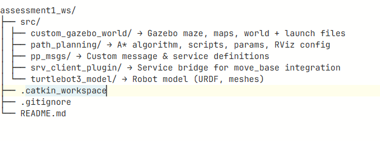

# COMP6009 Cognitive Robotics — Group 8

## Maintainers
- **Nathaniel Kisakye (nk479)** — Maintainer  
- **Samuel Ametefe (sa2090)** — Maintainer  
- **Princeston Kingston (pk419)**
- **Joe Belgard (jb2276)**

---

## Project Overview
This repository contains our work for the **COMP6009 Group Project** —  
*Shortest-Path Navigation using Turtlebot3 in Gazebo and RViz.*

The workspace has been preconfigured for **Docker**, ensuring everyone develops and tests in the same ROS environment.  
All packages and launch files are already included, so all you need to do is **clone**, **build**, and **start coding**.

> **Note:**  
> `build/` and `devel/` folders are excluded via `.gitignore`.  
> Git automatically ignores them when you commit or push — so you never have to worry about uploading large build folders.

---

## Cleaning up previous Gazebo Processes

```sh
rosnode kill /gazebo /gazebo_gui 2>/dev/null || true
killall -9 gzserver gzclient 2>/dev/null || true
source devel/setup.bash
```


## Repository Structure




> 🛑 *Do **NOT** edit `build/` or `devel/` — those are auto-generated after building.*
 
## Environment Setup (Docker)

Setting up Docker for this project is straightforward.  
If you need a refresher, check the Moodle guide here:  
[University Docker Setup (Moodle)](https://moodle.kent.ac.uk/2025/mod/wiki/view.php?id=99986)

The steps below show how to clone and build this workspace **inside Docker**.

---

### Step 1 — Ensure Docker is running
Start **Docker Desktop** before continuing.

Then open your container terminal (you should see `rosoperator@...`).

---

### Step 2 — Clone and build the workspace
```sh
cd ~                                # Go to your home directory

git clone https://git.cs.kent.ac.uk/nk479/comp6009-group-project-group8.git assessment1_ws  # Clone the repo and save it in a folder called assessment1_ws
 
cd assessment1_ws                   # Enter the workspace folder

catkin_make                         # Build the workspace (creates build/ & devel/)

source devel/setup.bash             # Source the environment
```
if you wish to auto source you can do it by doing:
```sh
    echo "source ~/assessment1_ws/devel/setup.bash" >> ~/.bashrc
```

Reference: [ROS Setup Guide](https://industrial-training-master.readthedocs.io/en/foxy/_source/session1/ros2/0-ROS-Setup.html)

The workspace should be built and be ready to run now
---
## Working on the Project
Always build inside Docker

Run catkin_make inside the container, never on Windows.

**Each session:**
```sh
cd ~/assessment1_ws
source devel/setup.bash
```

Edit your package files

Modify or add scripts inside:

src/<your_package>/


Example:

src/path_planning/scripts/path_planning.py

---

# Start Navigation Stack 

### Launch Gazebo:

In your workspace
```sh
source devel/setup.bash

roslaunch custom_gazebo_world custom_world.launch
```
### Launch RVIZ Path Plan:
In your workspace
```sh
source devel/setup.bash

roslaunch path_planning turtlebot3_custom_world.launch
```
---
# SLAM Methods Used
Within the repository we have three SLAM options available: Hector, RTAB, and Karto. We ultimately chose to use Karto. Its generated `.yaml` and `.pgm` files are saved under `turtlebot3_karto`, and the map is loaded in RViz as `maze_karto` as specified in the launch file.
Further justification for choosing Karto is provided in the project report.


---
# Git Commit, Push  & Merge 
## Commit & push changes
```
git checkout dev

git pull

git add .

git commit -m "what you implemented"

git push
```
## Merge
You can do merge requests using the gitlab UI but terminal is as follows 
```
git checkout main   # switch to main branch 
git merge dev       # Merge dev into main 

```
---

## Team Guidelines

Always pull before pushing.

Keep commits short, clear, and meaningful.

Test in RViz or Gazebo before merging.

If something breaks, message group chat.

Ask before editing someone else’s code.

---

## Submission Checklist

Before submitting on Moodle:

git pull origin main

Run catkin_make inside Docker (to rebuild)

Test all launch files

Zip the entire assessment1_ws/ folder, including build/ and devel/

Upload the zip + report PDF to Moodle

---

